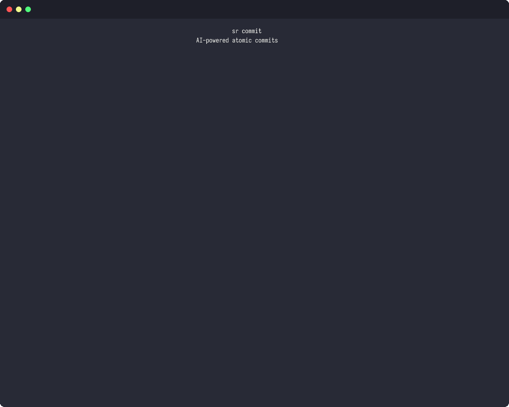

<p align="center">
  <h1 align="center">sr</h1>
  <p align="center">
    AI-powered release engineering CLI — from commit to release.
    <br /><br />
    <a href="https://github.com/urmzd/sr/releases">Download</a>
    &middot;
    <a href="https://github.com/urmzd/sr/issues">Report Bug</a>
    &middot;
    <a href="https://github.com/urmzd/sr/blob/main/action.yml">GitHub Action</a>
  </p>
</p>

<p align="center">
  <a href="https://github.com/urmzd/sr/actions/workflows/ci.yml"></a>
</p>

## Showcase

<p align="center">
  
</p>

## Why?

Release engineering involves more than just bumping a version. You write commits, review code, create PRs, and then cut a release. Most tools only handle the last step — and even then require Node.js and a pile of plugins.

**sr** handles the full lifecycle:

- **AI-powered commits** — `sr commit` analyzes your changes and generates atomic conventional commits
- **AI code review** — `sr review` gives you instant feedback on staged changes
- **AI PR generation** — `sr pr` creates title + body from your branch commits
- **Automated releases** — `sr release` bumps versions, generates changelogs, tags, and publishes
- **Single static binary** — no runtime, no package manager
- **Language-agnostic** — works with any project that uses git tags for versioning
- **Zero-config defaults** — conventional commits + semver + GitHub releases out of the box

## Features

### AI-powered workflow
- AI commit generation with atomic grouping and conventional commit format (`sr commit`)
- AI code review with severity-based feedback (`sr review`)
- AI PR title + body generation (`sr pr`)
- AI branch name suggestions (`sr branch`)
- AI commit explanation (`sr explain`)
- Freeform Q&A about your repo (`sr ask`)
- Multiple AI backends: Claude, GitHub Copilot, Gemini (auto-detected with fallback)
- Commit plan caching for incremental re-analysis

### Safety

AI commands run with strict sandboxing to prevent the agent from modifying your repository:

- **Read-only git access** — the agent can only run read-only git subcommands (`diff`, `log`, `show`, `status`, `ls-files`, `rev-parse`, `branch`, `cat-file`, `rev-list`, `shortlog`, `blame`). Mutating commands (`add`, `commit`, `push`, `reset`, `clean`, `rm`, `checkout`, etc.) are blocked at the tool-permission level.
- **File reads only** — the agent can read files but cannot write, delete, or execute arbitrary commands.
- **Working tree snapshots** — before the agent runs, `sr commit` saves a full snapshot of your working tree (staged files, unstaged changes, and untracked files). If anything goes wrong, the snapshot is automatically restored on failure. On success, the snapshot is cleared.
- **All mutations are programmatic** — staging, committing, and branching are performed by sr's own code *after* the agent returns its plan, never by the agent itself.

Snapshots are stored in the platform data directory, completely outside the repository:

| Platform | Location |
|----------|----------|
| macOS | `~/Library/Application Support/sr/snapshots/<repo-id>/` |
| Linux | `~/.local/share/sr/snapshots/<repo-id>/` |
| Windows | `%LOCALAPPDATA%/sr/snapshots/<repo-id>/` |

If a snapshot restore fails, the snapshot is preserved for manual recovery and its path is printed to stderr.

### Release automation
- Conventional Commits parsing (built-in, configurable via `commit_pattern`)
- `BREAKING CHANGE:` / `BREAKING-CHANGE:` footer detection (in addition to `!` suffix)
- Semantic versioning bumps (major / minor / patch) with v0 protection (breaking changes are downshifted from major to minor while the version is `0.x.y` to prevent accidental graduation to v1 — bypass with `--force`)
- Automatic version file bumping (Cargo.toml, package.json, pyproject.toml, pom.xml, Gradle, Go)
- Changelog generation (markdown, with configurable sections and compare URLs)
- GitHub Releases (via REST API — no external tools needed)
- Draft releases and signed tags (GPG/SSH)
- SHA256 checksum sidecar files for uploaded artifacts
- Customizable release names via minijinja templates
- Structured JSON output for CI piping (`sr release | jq .version`)
- Trunk-based workflow (tag + release from `main`)

## Installation

### Shell installer (Linux/macOS)

```sh
curl -fsSL https://raw.githubusercontent.com/urmzd/sr/main/install.sh | sh
```

The installer automatically adds `~/.local/bin` to your `PATH` in your shell profile (`.zshrc`, `.bashrc`, or `config.fish`).

### GitHub Action (recommended)

```yaml
- uses: urmzd/sr@v2
  with:
    github-token: ${{ secrets.GITHUB_TOKEN }}
```

### Usage

Minimal — release on every push to `main`:

```yaml
name: Release
on:
  push:
    branches: [main]

jobs:
  release:
    runs-on: ubuntu-latest
    permissions:
      contents: write
    steps:
      - uses: actions/checkout@v4
        with:
          fetch-depth: 0
      - uses: urmzd/sr@v2
```

Dry-run on pull requests:

```yaml
      - uses: urmzd/sr@v2
        with:
          command: release
          dry-run: "true"
```

Use outputs in subsequent steps:

```yaml
      - uses: urmzd/sr@v2
        id: sr
      - if: steps.sr.outputs.released == 'true'
        run: echo "Released ${{ steps.sr.outputs.version }}"
```

Upload artifacts to the release:

```yaml
      # Build artifacts are downloaded into release-assets/
      - uses: actions/download-artifact@v4
        with:
          path: release-assets
          merge-multiple: true

      - uses: urmzd/sr@v2
        with:
          artifacts: "release-assets/*"
```

The `artifacts` input accepts glob patterns (newline or comma separated). All matching files are uploaded to the GitHub release. This keeps artifact handling self-contained in the action — no separate upload steps needed.

Run a build step between version bump and commit (useful for lock files, codegen, etc.):

```yaml
      - uses: urmzd/sr@v2
        with:
          build-command: "cargo build --release"
```

The command runs with `SR_VERSION` and `SR_TAG` environment variables set, so you can reference the new version in your build scripts.

Manual re-trigger with `workflow_dispatch` (useful when a previous release partially failed):

```yaml
name: Release
on:
  push:
    branches: [main]
  workflow_dispatch:
    inputs:
      force:
        description: "Re-release the current tag"
        type: boolean
        default: false

jobs:
  release:
    runs-on: ubuntu-latest
    permissions:
      contents: write
    steps:
      - uses: actions/checkout@v4
        with:
          fetch-depth: 0
      - uses: urmzd/sr@v2
        with:
          force: ${{ github.event.inputs.force || 'false' }}
```

#### Inputs

| Input | Description | Default |
|-------|-------------|---------|
| `command` | The `sr` subcommand to run (`release`, `plan`, `changelog`, `version`, `config`, `completions`, `commit`, `review`, `explain`, `branch`, `pr`, `ask`, `cache`) | `release` |
| `dry-run` | Preview changes without executing them | `false` |
| `force` | Re-release the current tag (use when a previous release partially failed) | `false` |
| `config` | Path to the config file | `sr.yaml` |
| `github-token` | GitHub token for creating releases | `${{ github.token }}` |
| `git-user-name` | Git user name for tag creation | `sr[bot]` |
| `git-user-email` | Git user email for tag creation | `sr[bot]@urmzd.com` |
| `artifacts` | Glob patterns for artifact files to upload (newline or comma separated) | `""` |
| `build-command` | Shell command to run after version bump, before commit (`SR_VERSION` and `SR_TAG` env vars available) | `""` |

#### Outputs

| Output | Description |
|--------|-------------|
| `version` | The released version (empty if no release) |
| `previous-version` | The previous version before this release (empty if first release) |
| `tag` | The git tag created for this release (empty if no release) |
| `bump` | The bump level applied (`major`/`minor`/`patch`, empty if no release) |
| `floating-tag` | The floating major tag (e.g. `v3`, empty if disabled or no release) |
| `commit-count` | Number of commits included in this release |
| `released` | Whether a release was created (`true`/`false`) |
| `json` | Full release metadata as JSON (empty if no release) |

### Binary download

Download the latest release for your platform from
[Releases](https://github.com/urmzd/sr/releases):

| Target | File |
|--------|------|
| Linux x86_64 (glibc) | `sr-x86_64-unknown-linux-gnu` |
| Linux aarch64 (glibc) | `sr-aarch64-unknown-linux-gnu` |
| Linux x86_64 (musl/static) | `sr-x86_64-unknown-linux-musl` |
| Linux aarch64 (musl/static) | `sr-aarch64-unknown-linux-musl` |
| macOS x86_64 | `sr-x86_64-apple-darwin` |
| macOS aarch64 | `sr-aarch64-apple-darwin` |
| Windows x86_64 | `sr-x86_64-pc-windows-msvc.exe` |

The MUSL variants are statically linked and work on any Linux distribution (Alpine, Debian, RHEL, etc.). Prefer these for maximum compatibility.

```bash
mkdir -p ~/.local/bin
chmod +x sr-* && mv sr-* ~/.local/bin/sr
```

Ensure `~/.local/bin` is on your `$PATH`.

### Build from source

```bash
cargo install --path crates/sr-cli
```

## Prerequisites

`sr release` calls the GitHub REST API directly — no external tools are needed. Authentication is via an environment variable:

```bash
export GH_TOKEN=ghp_xxxxxxxxxxxx   # or GITHUB_TOKEN
```

The GitHub Action sets this automatically via the `github-token` input. Dry-run mode (`sr release --dry-run`) works without a token.

## GitHub Enterprise Server (GHES)

`sr` works with GitHub Enterprise Server out of the box. The hostname is auto-detected from your git remote URL — changelog links, compare URLs, and API calls will point to the correct host automatically.

### Setup

Set your `GH_TOKEN` (or `GITHUB_TOKEN`) environment variable with a token that has access to your GHES instance:

```bash
export GH_TOKEN=ghp_xxxxxxxxxxxx
```

No additional host configuration is needed — `sr` derives the API base URL from the git remote hostname automatically (e.g. `ghes.example.com` → `https://ghes.example.com/api/v3`).

### How it works

1. `sr` reads the `origin` remote URL and extracts the hostname (e.g. `ghes.example.com`).
2. Changelog links and compare URLs use `https://<hostname>/owner/repo/...` instead of hardcoded `github.com`.
3. REST API calls are routed to `https://<hostname>/api/v3/...` automatically.

## Quick Start

```bash
# AI-powered commits from your changes
sr commit

# AI code review
sr review

# Generate a PR
sr pr --create

# Preview what the next release would look like
sr plan

# Execute the release
sr release

# Set up shell completions (bash)
sr completions bash >> ~/.bashrc
```

## Developer Workflow

### Commit message validation

`sr` manages git hooks through the `hooks` section in `sr.yaml`. Hook entries can be **simple commands** (strings) or **structured steps** with file-pattern matching. Every command receives a JSON context on stdin with the hook's arguments — pipe it to `jq`, parse it in your script, or ignore it.

```yaml
# sr.yaml
hooks:
  commit-msg:
    - sr hook commit-msg                          # simple command
  pre-commit:
    - step: format                                # structured step — runs only when staged files match
      patterns:
        - "*.rs"
      rules:
        - "rustfmt --check --edition 2024 {files}"
    - step: lint
      patterns:
        - "*.rs"
      rules:
        - "cargo clippy --workspace -- -D warnings"
  pre-push:
    - cargo test --workspace                      # simple command
```

Structured steps only run when staged files match the `patterns` globs. Rules containing `{files}` receive the matched file list.

Hooks are installed as thin wrappers in `.githooks/` that call `sr hook run <name>`:

```bash
sr init              # writes fully-commented sr.yaml + installs hooks
sr init --merge      # add new default fields to existing sr.yaml without overwriting customizations
sr init --force      # overwrite sr.yaml with a fresh fully-commented template
sr init --no-hooks   # writes sr.yaml only (no hook installation)
sr hook install      # re-install hooks after editing sr.yaml
```

**JSON context** piped to each command (example for `commit-msg`):

```json
{"hook": "commit-msg", "args": [".git/COMMIT_EDITMSG"], "message_file": ".git/COMMIT_EDITMSG"}
```

Known hooks get named fields (`message_file`, `remote_name`, `remote_url`, `upstream`, `branch`, etc.) alongside the raw `args` array. Unknown hooks still receive `hook` and `args`.

The built-in `sr hook commit-msg` validates the first line against the configured `commit_pattern` and `types`. Merge commits and rebase-generated commits (`fixup!`, `squash!`, `amend!`) are always allowed through.

### End-to-end release flow

```
sr commit → sr review → sr pr → push → sr plan → sr release
```

1. **Commit** — `sr commit` analyzes changes and creates atomic conventional commits (or the commit-msg hook validates manual commits).
2. **Review** — `sr review` provides AI code review before pushing.
3. **PR** — `sr pr --create` generates and opens a pull request.
4. **Preview** — run `sr plan` to see the next version, included commits, and a changelog preview.
5. **Dry-run** — run `sr release --dry-run` to simulate the full release without side effects (no tags created).
6. **Release** — run `sr release` to execute the full pipeline:
   - Bumps version in configured manifest files
   - Runs `build_command` if configured (with `SR_VERSION` and `SR_TAG` env vars)
   - Generates and commits the changelog (with version files)
   - Creates and pushes the git tag
   - Creates a GitHub release
   - Outputs structured JSON to stdout (pipe to `jq` for custom workflows)

## Post-release hooks

`sr` outputs structured JSON to stdout, making it easy to trigger post-release actions.

### GitHub Actions

Use the action outputs to run steps conditionally:

```yaml
- uses: urmzd/sr@v2
  id: sr
- if: steps.sr.outputs.released == 'true'
  run: ./deploy.sh ${{ steps.sr.outputs.version }}
- if: steps.sr.outputs.released == 'true'
  run: |
    curl -X POST "$SLACK_WEBHOOK" \
      -d "{\"text\": \"Released v${{ steps.sr.outputs.version }}\"}"
```

### CLI

Pipe `sr release` output to downstream scripts:

```bash
# Extract the version
VERSION=$(sr release | jq -r '.version')

# Feed JSON into a custom script
sr release | my-post-release-hook.sh

# Publish to a package registry after release
VERSION=$(sr release | jq -r '.version')
if [ -n "$VERSION" ]; then
  npm publish
fi
```

### JSON output schema

`sr release` prints a JSON object to stdout on success:

```json
{
  "version": "1.2.3",
  "previous_version": "1.2.2",
  "tag": "v1.2.3",
  "bump": "patch",
  "floating_tag": "v1",
  "commit_count": 4
}
```

All diagnostic messages go to stderr, so stdout is always clean JSON (or empty on exit code 2).

## CLI Reference

### AI commands

| Command | Description |
|---------|-------------|
| `sr commit` | Generate atomic commits from changes (AI-powered) |
| `sr review` | AI code review of staged/branch changes |
| `sr explain` | Explain recent commits |
| `sr branch` | Suggest conventional branch name |
| `sr pr` | Generate PR title + body from branch commits |
| `sr ask` | Freeform Q&A about the repo |
| `sr cache` | Manage the AI commit plan cache |

### Release commands

| Command | Description |
|---------|-------------|
| `sr release` | Execute a release (tag + GitHub release) |
| `sr plan` | Show what the next release would look like |
| `sr changelog` | Generate or preview the changelog |
| `sr version` | Show the next version |
| `sr config` | Validate and display resolved configuration |
| `sr init` | Create a default `sr.yaml` config file |
| `sr completions` | Generate shell completions (bash, zsh, fish, powershell, elvish) |
| `sr hook` | Manage and run git hooks (`commit-msg`, `install`, `run`) |
| `sr update` | Update sr to the latest version |

### Global flags

All commands accept these flags for AI backend configuration:

| Flag | Env var | Description |
|------|---------|-------------|
| `--backend` | `SR_BACKEND` | AI backend: `claude`, `copilot`, or `gemini` (auto-detected if omitted) |
| `--model` | `SR_MODEL` | AI model to use |
| `--budget` | `SR_BUDGET` | Max budget in USD, claude only (default: 0.50) |
| `--debug` | `SR_DEBUG` | Enable debug output |

### Common flags

- `sr commit --staged` — only analyze staged changes
- `sr commit --dry-run` — preview commit plan without executing
- `sr commit --yes` — skip confirmation prompt
- `sr commit --no-cache` — bypass cache, always call AI
- `sr commit -M "context"` — provide additional context for commit generation
- `sr review --base main` — review against a specific base ref
- `sr pr --create` — create the PR via gh CLI
- `sr pr --draft` — create as draft PR
- `sr branch --create` — create the suggested branch
- `sr release -p core` — target a specific monorepo package
- `sr release --dry-run` — preview without making changes
- `sr release --force` — re-release the current tag (for partial failure recovery)
- `sr release --build-command 'npm run build'` — run a command after version bump, before commit
- `sr release --stage-files Cargo.lock` — stage additional files after build (repeatable)
- `sr release --pre-release-command 'cargo test'` — run a command before the release starts
- `sr release --post-release-command './notify.sh'` — run a command after the release completes
- `sr release --prerelease alpha` — produce pre-release versions (e.g. `1.2.0-alpha.1`)
- `sr release --sign-tags` — sign tags with GPG/SSH (`git tag -s`)
- `sr release --draft` — create GitHub release as a draft (requires manual publishing)
- `sr plan --format json` — machine-readable output
- `sr changelog --write` — write changelog to disk
- `sr version --short` — print only the version number
- `sr config --resolved` — show config with defaults applied
- `sr init --force` — overwrite existing config with a fresh fully-commented template
- `sr init --merge` — add new default fields to existing config without overwriting customizations
- `sr completions bash` — generate Bash completions

### Exit codes

| Code | Meaning |
|------|---------|
| `0` | Success — a release was created (or dry-run completed). The released version is printed to stdout. |
| `1` | Real error — configuration issue, git failure, VCS provider error, etc. |
| `2` | No releasable changes — no new commits or no releasable commit types since the last tag. |

### `--force` flag

Use `--force` to re-run a release that partially failed (e.g. the tag was created but artifact upload failed). Force mode only works when HEAD is exactly at the latest tag — it re-executes the release pipeline for that tag without bumping the version.

```bash
# Re-release the current tag after a partial failure
sr release --force
```

Force mode will error if:
- There are no tags yet (nothing to re-release)
- HEAD is not at the latest tag (there are new commits — use a normal release instead)

## Configuration

`sr` looks for `sr.yaml` in the repository root. All fields are optional and have sensible defaults.

Running `sr init` generates a fully-commented `sr.yaml` with every available option documented inline. When upgrading `sr` and new config fields are added, run `sr init --merge` to add them to your existing config without overwriting your customizations.

### Configuration reference

| Field | Type | Default | Description |
|-------|------|---------|-------------|
| `branches` | `string[]` | `["main", "master"]` | Branches that trigger releases |
| `tag_prefix` | `string` | `"v"` | Prefix for git tags (e.g. `v1.0.0`) |
| `commit_pattern` | `string` | See below | Regex for parsing commit messages (must use named groups: `type`, `scope`, `breaking`, `description`) |
| `breaking_section` | `string` | `"Breaking Changes"` | Changelog section heading for breaking changes |
| `misc_section` | `string` | `"Miscellaneous"` | Changelog section heading for commit types without an explicit section |
| `types` | `CommitType[]` | See below | Commit type definitions (name, bump level, changelog section) |
| `changelog.file` | `string?` | `null` | Path to the changelog file (e.g. `CHANGELOG.md`). Omit to skip changelog generation |
| `version_files` | `string[]` | `[]` | Manifest files to bump (see supported formats below) |
| `version_files_strict` | `bool` | `false` | When `true`, fail the release if any version file is unsupported. When `false`, skip unsupported files with a warning |
| `artifacts` | `string[]` | `[]` | Glob patterns for files to upload to the GitHub release |
| `floating_tags` | `bool` | `false` | Create floating major version tags (e.g. `v3` always points to the latest `v3.x.x` release) |
| `build_command` | `string?` | `null` | Shell command to run after version bump but before commit. `SR_VERSION` and `SR_TAG` env vars are set |
| `prerelease` | `string?` | `null` | Pre-release identifier (e.g. `"alpha"`, `"beta"`, `"rc"`). When set, versions are formatted as `X.Y.Z-<id>.N` |
| `stage_files` | `string[]` | `[]` | Additional file globs to stage after `build_command` runs (e.g. `["Cargo.lock"]`) |
| `pre_release_command` | `string?` | `null` | Shell command to run before the release starts (validation, checks). `SR_VERSION` and `SR_TAG` env vars are set |
| `post_release_command` | `string?` | `null` | Shell command to run after the release completes (notifications, deployments). `SR_VERSION` and `SR_TAG` env vars are set |
| `sign_tags` | `bool` | `false` | Sign annotated tags with GPG/SSH (`git tag -s` instead of `git tag -a`). Requires a signing key configured in git |
| `draft` | `bool` | `false` | Create GitHub releases as drafts. Draft releases are not visible to the public until manually published |
| `release_name_template` | `string?` | `null` | [Minijinja](https://docs.rs/minijinja) template for the GitHub release name. Variables: `version`, `tag_name`, `tag_prefix`. Default: uses the tag name (e.g. `v1.2.0`) |
| `changelog.template` | `string?` | `null` | Custom [minijinja](https://docs.rs/minijinja) template for changelog rendering. See template variables below |
| `hooks` | `map<string, HookEntry[]>` | `{commit-msg: ["sr hook commit-msg"]}` | Git hooks — simple commands or structured steps with file-pattern matching. See [Commit message validation](#commit-message-validation) |
| `packages` | `PackageConfig[]` | `[]` | Monorepo packages — each released independently. See [Monorepo support](#monorepo-support) |

### Example config

This is the fully-commented config generated by `sr init`. Every field is shown with its default value:

```yaml
# sr configuration

# Branches that trigger releases when commits are pushed.
branches:
  - main
  - master

# Prefix prepended to version tags (e.g. "v1.2.0").
tag_prefix: "v"

# Regex for parsing conventional commits.
# Required named groups: type, description.
# Optional named groups: scope, breaking.
commit_pattern: '^(?P<type>\w+)(?:\((?P<scope>[^)]+)\))?(?P<breaking>!)?:\s+(?P<description>.+)'

# Changelog section heading for breaking changes.
breaking_section: Breaking Changes

# Fallback changelog section for unrecognised commit types.
misc_section: Miscellaneous

# Commit type definitions.
# name:    commit type prefix (e.g. "feat", "fix")
# bump:    version bump level — major, minor, patch, or omit for no bump
# section: changelog section heading, or omit to exclude from changelog
types:
  - name: feat
    bump: minor
    section: Features
  - name: fix
    bump: patch
    section: Bug Fixes
  - name: perf
    bump: patch
    section: Performance
  - name: docs
    section: Documentation
  - name: refactor
    section: Refactoring
  - name: revert
    section: Reverts
  - name: chore
  - name: ci
  - name: test
  - name: build
  - name: style

# Changelog configuration.
# file:     path to the changelog file (e.g. CHANGELOG.md), or omit to skip writing
# template: custom Minijinja template string for changelog rendering
changelog:
  file: CHANGELOG.md
  template:

# Manifest files to bump on release (e.g. Cargo.toml, package.json, pyproject.toml).
# Auto-detected if empty.
version_files:
  - Cargo.toml
  - package.json

# Fail if a version file uses an unsupported format (default: skip unknown files).
version_files_strict: false

# Glob patterns for release assets to upload to GitHub (e.g. "dist/*.tar.gz").
artifacts: []

# Create floating major version tags (e.g. "v3" pointing to latest v3.x.x).
floating_tags: false

# Shell command to run after version files are bumped (e.g. "cargo build --release").
build_command:

# Additional files/globs to stage after build_command runs (e.g. Cargo.lock).
stage_files: []

# Pre-release identifier (e.g. "alpha", "beta", "rc").
# When set, versions are formatted as X.Y.Z-<id>.N where N auto-increments.
prerelease:

# Shell command to run before the release starts (validation, checks).
pre_release_command:

# Shell command to run after the release completes (notifications, deployments).
post_release_command:

# Sign annotated tags with GPG/SSH (git tag -s).
sign_tags: false

# Create GitHub releases as drafts (requires manual publishing).
draft: false

# Minijinja template for the GitHub release name.
# Available variables: version, tag_name, tag_prefix.
# Default: uses the tag name (e.g. "v1.2.0").
release_name_template:

# Git hooks configuration.
# Each key is a git hook name. Values can be simple commands or structured steps.
# Steps with patterns only run when staged files match the globs.
# Rules containing {files} receive the matched file list.
hooks:
  commit-msg:
    - sr hook commit-msg
  # pre-commit:
  #   - step: format
  #     patterns:
  #       - "*.rs"
  #     rules:
  #       - "rustfmt --check --edition 2024 {files}"
  #   - step: lint
  #     patterns:
  #       - "*.rs"
  #     rules:
  #       - "cargo clippy --workspace -- -D warnings"

# Monorepo packages (uncomment and configure if needed).
# packages:
#   - name: core
#     path: crates/core
#     tag_prefix: "core/v"
#     version_files:
#       - crates/core/Cargo.toml
#     changelog:
#       file: crates/core/CHANGELOG.md
#     build_command: cargo build -p core
#     stage_files:
#       - crates/core/Cargo.lock
```

### Supported version files

| Filename | Key updated | Method | Notes |
|---|---|---|---|
| `Cargo.toml` | `package.version` or `workspace.package.version` | TOML parser | Preserves formatting/comments. Also updates `[workspace.dependencies]` entries that have both `path` and `version` fields. **Auto-discovers workspace members** |
| `package.json` | `version` | JSON parser | Pretty-printed output with trailing newline. **Auto-discovers npm workspace members** |
| `pyproject.toml` | `project.version` or `tool.poetry.version` | TOML parser | Preserves formatting/comments. Supports both PEP 621 and Poetry layouts. **Auto-discovers uv workspace members** |
| `pom.xml` | First `<version>` after `</parent>` (or `</modelVersion>`) | Regex | Skips the `<parent>` block to avoid changing the parent version |
| `build.gradle` | `version = '...'` or `version = "..."` | Regex | Only replaces the first match (avoids changing dependency versions) |
| `build.gradle.kts` | `version = "..."` | Regex | Only replaces the first match |
| `*.go` | `var Version = "..."` or `const Version string = "..."` | Regex | Matches the first `Version` variable/constant declaration |

#### Workspace auto-discovery

When bumping a workspace root, `sr` automatically finds and bumps all member manifests — no need to list them individually in `version_files`:

| Ecosystem | Root indicator | Members discovered via |
|-----------|---------------|----------------------|
| **Cargo** | `[workspace]` with `members` | `workspace.members` globs → member `Cargo.toml` files (skips `version.workspace = true`) |
| **npm** | `workspaces` array in `package.json` | `workspaces` globs → member `package.json` files (skips members without `version`) |
| **uv** | `[tool.uv.workspace]` with `members` | `tool.uv.workspace.members` globs → member `pyproject.toml` files (skips members without `version`) |

For example, a Cargo workspace only needs the root listed:

```yaml
version_files:
  - Cargo.toml    # automatically bumps all workspace member Cargo.toml files
```

### Environment variables

| Variable | Context | Description |
|----------|---------|-------------|
| `GH_TOKEN` / `GITHUB_TOKEN` | Release | GitHub API token for creating releases and uploading artifacts. Not needed for `--dry-run` |
| `SR_VERSION` | All hooks | The new version string (e.g. `1.2.3`), set for `pre_release_command`, `build_command`, and `post_release_command` |
| `SR_TAG` | All hooks | The new tag name (e.g. `v1.2.3`), set for `pre_release_command`, `build_command`, and `post_release_command` |
| `SR_BACKEND` | AI commands | AI backend to use (`claude`, `copilot`, `gemini`) |
| `SR_MODEL` | AI commands | AI model to use |
| `SR_BUDGET` | AI commands | Max budget in USD for Claude backend |
| `SR_DEBUG` | AI commands | Enable debug output for AI calls |

### Commit types

Each entry in the `types` list has these fields:

| Field | Type | Required | Description |
|-------|------|----------|-------------|
| `name` | `string` | Yes | The commit type prefix (e.g. `feat`, `fix`) |
| `bump` | `string?` | No | Bump level: `major`, `minor`, or `patch`. Omit to not trigger a release for this type |
| `section` | `string?` | No | Changelog section heading (e.g. `"Features"`). Omit to exclude from changelog |

Breaking changes are detected in two ways per the [Conventional Commits](https://www.conventionalcommits.org/) spec:

1. **`!` suffix** — e.g. `feat!: new API` or `fix(core)!: rename method`
2. **`BREAKING CHANGE:` footer** — a line starting with `BREAKING CHANGE:` or `BREAKING-CHANGE:` in the commit body

Either form triggers a `major` bump regardless of the type's configured bump level.

#### Default commit-type mapping

| Type | Bump | Changelog Section |
|------|------|-------------------|
| `feat` | minor | Features |
| `fix` | patch | Bug Fixes |
| `perf` | patch | Performance |
| `docs` | — | Documentation |
| `refactor` | — | Refactoring |
| `revert` | — | Reverts |
| `chore` | — | — |
| `ci` | — | — |
| `test` | — | — |
| `build` | — | — |
| `style` | — | — |

Types without a bump level do not trigger a release on their own. Types without a section are grouped under the `misc_section` heading if they appear in a release with other releasable commits.

### Commit pattern

The default pattern follows the [Conventional Commits](https://www.conventionalcommits.org/) spec:

```
^(?P<type>\w+)(?:\((?P<scope>[^)]+)\))?(?P<breaking>!)?:\s+(?P<description>.+)
```

If you override `commit_pattern`, your regex **must** include these named capture groups:

| Group | Required | Description |
|-------|----------|-------------|
| `type` | Yes | The commit type (e.g. `feat`, `fix`) |
| `scope` | No | Optional scope in parentheses |
| `breaking` | No | The `!` marker for breaking changes |
| `description` | Yes | The commit description |

### Changelog behavior

When `changelog.file` is set:
- If the file doesn't exist, it's created with a `# Changelog` heading
- If it already exists, new entries are inserted after the first heading (prepended, not appended)
- Each entry has the format: `## <version> (<date>)`
- Sections appear in order: Breaking Changes, then type sections in definition order, then Miscellaneous
- Commits link to their full SHA on GitHub when the repo URL is available

### Changelog templates

Set `changelog.template` to a [minijinja](https://docs.rs/minijinja) (Jinja2-compatible) template string for full control over changelog output. When set, the default markdown format is bypassed entirely.

**Template context:**

| Variable | Type | Description |
|----------|------|-------------|
| `entries` | `ChangelogEntry[]` | Array of release entries (newest first for `--regenerate`) |
| `entries[].version` | `string` | Version string (e.g. `1.2.3`) |
| `entries[].date` | `string` | Release date (`YYYY-MM-DD`) |
| `entries[].commits` | `ConventionalCommit[]` | Array of commits in this release |
| `entries[].compare_url` | `string?` | GitHub compare URL (may be null) |
| `entries[].repo_url` | `string?` | Repository URL (may be null) |
| `entries[].commits[].sha` | `string` | Full commit SHA |
| `entries[].commits[].type` | `string` | Commit type (e.g. `feat`, `fix`) |
| `entries[].commits[].scope` | `string?` | Commit scope (may be null) |
| `entries[].commits[].description` | `string` | Commit description |
| `entries[].commits[].body` | `string?` | Commit body (may be null) |
| `entries[].commits[].breaking` | `bool` | Whether this is a breaking change |

**Example template:**

```yaml
changelog:
  file: CHANGELOG.md
  template: |
    
    ## {{ entry.version }} ({{ entry.date }})
    
    - **{{ c.scope }}**: {{ c.description }}
    
    
```

### Release execution order

Understanding the execution order helps when configuring hooks:

1. **Pre-release command** — `pre_release_command` runs first (validation, checks)
2. **Bump version files** — all configured `version_files` are updated on disk
3. **Write changelog** — the changelog file is written (if configured)
4. **Run build command** — `build_command` runs with `SR_VERSION`/`SR_TAG` set. Version files already contain the new version
5. **Git commit** — version files + changelog + `stage_files` are staged and committed as `chore(release): <tag> [skip ci]`
6. **Create and push tag** — annotated tag at HEAD (signed with GPG/SSH when `sign_tags: true`)
7. **Create/update floating tag** (if `floating_tags: true`)
8. **Create or update GitHub release** — uses PATCH to preserve existing assets on re-runs; supports `draft` mode
9. **Upload artifacts** — with SHA256 checksum sidecar files (`.sha256`) and MIME-type-aware uploads
10. **Verify release** — confirms the GitHub release exists and is accessible
11. **Post-release command** — `post_release_command` runs last (notifications, deployments)

If any step in 1-4 fails, modified files are automatically rolled back to their original contents. Steps 6-10 are idempotent — re-running with `--force` will skip already-completed steps.

### Pre-releases

Set `prerelease` to produce versions like `1.2.0-alpha.1` instead of `1.2.0`:

```yaml
prerelease: alpha
```

Or via CLI: `sr release --prerelease alpha`

**Behavior:**
- The version is based on the latest *stable* tag (pre-release tags are skipped when computing the base)
- The counter auto-increments by scanning existing tags: `1.2.0-alpha.1` → `1.2.0-alpha.2` → ...
- Switching identifiers resets the counter: `1.2.0-alpha.3` → `1.2.0-beta.1`
- The GitHub release is marked as a pre-release
- Floating tags are not updated for pre-releases
- Stable releases (`prerelease: null`) skip over pre-release tags entirely

### Monorepo support

For repositories containing multiple independently versioned packages, use the `packages` config:

```yaml
# sr.yaml
packages:
  - name: core
    path: crates/core
    version_files:
      - crates/core/Cargo.toml
    changelog:
      file: crates/core/CHANGELOG.md
  - name: cli
    path: crates/cli
    tag_prefix: "cli-v"              # default: "cli/v"
    version_files:
      - crates/cli/Cargo.toml
    build_command: "cargo build -p cli --release"
    stage_files:
      - crates/cli/Cargo.lock
```

Each package is released independently — commits are filtered by path, so only changes touching a package's directory trigger its release. Tags are scoped per package (e.g. `core/v1.2.0`, `cli-v3.0.0`).

Use `-p/--package` to target a specific package:

```bash
sr release -p core              # release only the core package
sr plan -p cli --format json    # preview next release for cli
sr version -p core --short      # show next version for core
sr changelog -p cli --write     # generate changelog for cli
```

**Package config fields:**

| Field | Type | Default | Description |
|-------|------|---------|-------------|
| `name` | `string` | — (required) | Package name, used in the default tag prefix |
| `path` | `string` | — (required) | Directory path relative to repo root. Only commits touching this path trigger a release |
| `tag_prefix` | `string?` | `"{name}/v"` | Tag prefix override |
| `version_files` | `string[]` | inherited | Version files override (inherits root if empty) |
| `changelog` | `object?` | inherited | Changelog config override |
| `build_command` | `string?` | inherited | Build command override |
| `stage_files` | `string[]` | inherited | Stage files override (inherits root if empty) |

All other config fields (`types`, `branches`, `commit_pattern`, etc.) are inherited from the root config.

When `packages` is empty or absent, `sr` behaves as a single-package tool (no change from previous behavior).

### Limitations

- **GitHub only** — the `VcsProvider` trait exists for extensibility, but only GitHub is implemented

## FAQ / Troubleshooting

### Migrating from v0.x to v1

v1.0.0 introduced two breaking changes:

1. **Lifecycle hooks removed** — the `hooks` config fields (`pre_release`, `post_release`) inside the release pipeline were removed. They mixed concerns and caused a CI bug where hook stdout leaked into sr's machine-readable output. Replace them with:
   - `pre_release_command` / `post_release_command` config fields (added in v1.x), or
   - Separate CI pipeline steps before/after `sr release`

2. **Structured JSON output** — `sr release` now prints JSON to stdout instead of plain text. If you were parsing stdout, update your scripts to use `jq`:
   ```bash
   # Old
   VERSION=$(sr release)
   # New
   VERSION=$(sr release | jq -r '.version')
   ```

### `sr release` exits with code 2

Exit code 2 means **no releasable commits** were found since the last tag. This is not an error — it means all commits since the last release are non-bumping types (e.g. `chore`, `docs`, `ci`). To force a release anyway, use `sr release --force`.

### AI commands fail with no backend found

`sr` auto-detects AI backends by checking for CLIs in this order: Claude (`claude`), GitHub Copilot (`gh copilot`), Gemini (`gemini`). If none are found, AI commands will fail. Install one of these CLIs or specify explicitly with `--backend`.

### Changelog is not generated

Set `changelog.file` in `sr.yaml` — changelog generation is opt-in:
```yaml
changelog:
  file: CHANGELOG.md
```

### Version files not updated

Ensure your manifest files are listed in `version_files` and match a [supported format](#supported-version-files). Set `version_files_strict: true` to fail loudly on unsupported files instead of silently skipping them.

### Tags are not signed

Set `sign_tags: true` in `sr.yaml` or pass `--sign-tags`. You must have a GPG or SSH signing key configured in git (`git config user.signingkey`).

## Architecture

| Crate | Description |
|-------|-------------|
| [`sr-core`](crates/sr-core/) | Pure domain logic — traits, config, versioning, changelog |
| [`sr-git`](crates/sr-git/) | Git implementation (native `git` CLI) |
| [`sr-github`](crates/sr-github/) | GitHub VCS provider (REST API) |
| [`sr-ai`](crates/sr-ai/) | AI backends, caching, and AI-powered git commands |
| [`sr-cli`](crates/sr-cli/) | CLI binary (`clap`) — wires everything together |

`action.yml` in the repo root is the GitHub Action composite wrapper.

`sr` uses a pluggable `VcsProvider` trait and currently ships with GitHub support. GitLab, Bitbucket, and other providers can be added as separate crates implementing the same trait.

### Core traits

| Trait | Purpose |
|-------|---------|
| `GitRepository` | Tag discovery, commit listing, tag creation, push |
| `VcsProvider` | Remote release creation, updates, asset uploads, verification |
| `CommitParser` | Raw commit to conventional commit |
| `ChangelogFormatter` | Render changelog entries to text |
| `ReleaseStrategy` | Orchestrate plan + execute |

## Design Philosophy

1. **End-to-end** — sr covers the full release lifecycle from commit to release, not just the last step.
2. **AI-native** — AI is a first-class concern, not a plugin. Every workflow step benefits from intelligent automation.
3. **Trunk-based flow** — releases happen from a single branch; no release branches.
4. **Conventional commits as source of truth** — commit messages drive versioning.
5. **Zero-config** — works out of the box with reasonable defaults.
6. **Language-agnostic** — sr knows about git and semver, not about cargo or npm.

## Development

Requires [just](https://github.com/casey/just) for task running.

```bash
just init          # Install clippy + rustfmt
just check         # Run all checks (format, lint, test)
just build         # Build workspace
just test          # Run tests
just lint          # Run clippy
just fmt           # Format code
just run plan      # Run the CLI
```

See the [Justfile](Justfile) for all available recipes.

## Agent Skill

This project ships an [Agent Skill](https://github.com/vercel-labs/skills) for use with Claude Code, Cursor, and other compatible agents.

**Install:**

```sh
npx skills add urmzd/sr
```

Once installed, use `/sr` to plan, dry-run, or execute releases from conventional commits.

## Contributing

See [CONTRIBUTING.md](CONTRIBUTING.md) for development setup, code style, and PR guidelines.
